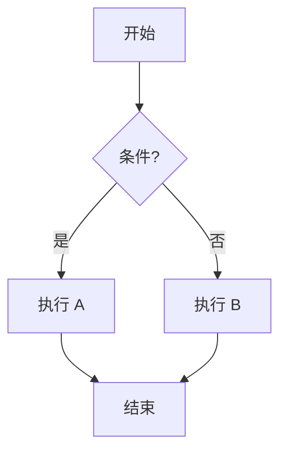
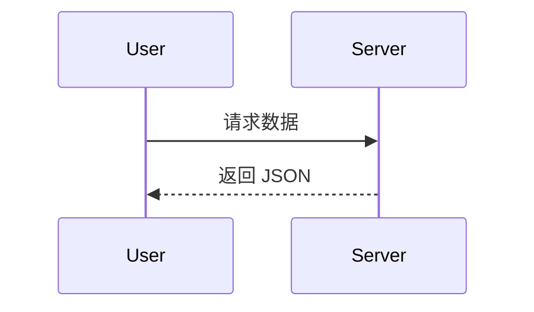
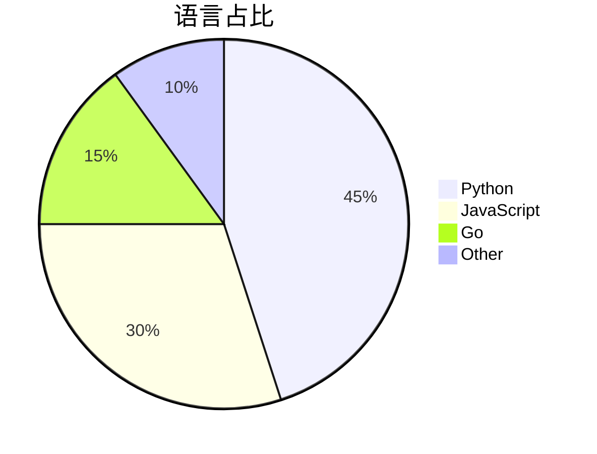
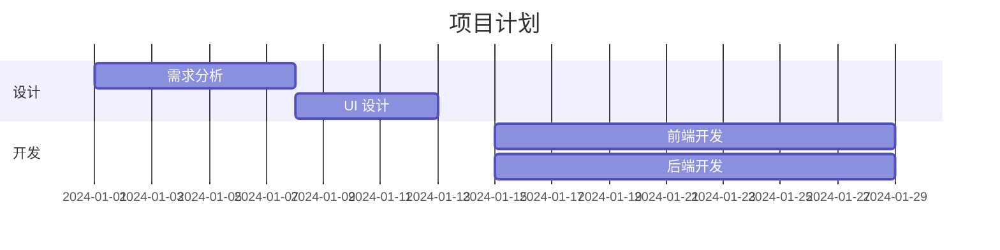

# Markdown 语法速查 + 小细节

收集 GitHub 上好用但容易被忽略的 Markdown / HTML 小细节。

---

## 1. 文本样式

```markdown
**加粗**
*斜体*
***加粗斜体***
~~删除线~~
`行内代码`
<u>下划线（需 HTML）</u>
H~2~O 下标（需 HTML 或部分扩展）
X^2^ 上标（部分扩展）
```

效果：

**加粗** · *斜体* · ***加粗斜体*** · ~~删除线~~ · `行内代码` · <u>下划线</u> · H<sub>2</sub>O · X<sup>2</sup>

---

## 2. 键盘按键样式

```markdown
按 <kbd>Ctrl</kbd> + <kbd>C</kbd> 复制
```

按 <kbd>Ctrl</kbd> + <kbd>C</kbd> 复制

---

## 3. 任务列表 / 复选框

```markdown
- [x] 已完成任务
- [ ] 未完成任务
- [ ] 第三项
```

- [x] 已完成任务
- [ ] 未完成任务
- [ ] 第三项

在 Issue / PR 里可以直接点击勾选。

---

## 4. 脚注（GitHub 支持）

```markdown
这里有一个脚注[^1]。

[^1]: 这是脚注的内容。
```

这里有一个脚注[^1]。

[^1]: 这是脚注的内容。

---

## 5. 自动链接

```markdown
https://github.com
<https://github.com>
user@example.com
<user@example.com>
```

会自动变成可点击链接。

---

## 6. 提及与引用

```markdown
@用户名          → 提及用户
#123             → 引用 Issue
GH-123           → 引用 Issue
OWNER/REPO#123   → 跨仓库 Issue
```

---

## 7. Emoji

```markdown
:rocket: :star: :heart: :warning: :bulb: :100: :tada:
:sparkles: :fire: :bug: :books: :wrench: :package:
```

效果：🚀 ⭐ ❤️ ⚠️ 💡 💯 🎉 ✨ 🐞 🐛 📚 🔧 📦

完整列表：https://github.com/ikatyang/emoji-cheat-sheet

---

## 8. 高亮标记

GitHub 原生 Markdown **不支持** `==高亮==`，但可用：

```html
<mark>高亮文本</mark>
```

效果：<mark>高亮文本</mark>

---

## 9. 折叠内容

```markdown
<details>
  <summary>点击展开</summary>

  内容写在这里（前后空行很重要）

</details>
```

注意：
1. `<summary>` 和正文之间必须有空行
2. `</details>` 前也要有空行
3. 否则内容会以纯文本显示

---

## 10. 图片进阶

### 10.1 指定宽高

```html


```

### 10.2 居中

```html
<div align="center">
  
</div>
```

### 10.3 相对路径 + 锚点链接图片

```markdown
[](https://example.com)
```

### 10.4 暗色模式适配（仅部分仓库支持）

```html
<picture>
  <source media="(prefers-color-scheme: dark)" srcset="./logo-dark.png">
  
</picture>
```

---

## 11. 贡献者徽章（All Contributors）

```markdown
<a href="https://github.com/OWNER/REPO/graphs/contributors">
  
</a>
```

用 [allcontributors.org](https://allcontributors.org) 机器人自动生成贡献者列表：

```markdown
@all-contributors please add @alice for code, doc
```

---

## 12. Mermaid 图表

GitHub 原生支持 Mermaid：

````markdown

````


### 常用图表类型







更多类型：`flowchart` `sequenceDiagram` `classDiagram` `stateDiagram` `erDiagram` `journey` `gantt` `pie` `mindmap` `timeline` `quadrantChart` `xychart-beta`

---

## 13. 数学公式（LaTeX）

GitHub 支持 `$...$` 与 `$$...$$`：

```markdown
行内公式：$E = mc^2$

块级公式：

$$
\sum_{i=1}^{n} i = \frac{n(n+1)}{2}
$$
```

效果：

行内公式：$E = mc^2$

块级公式：

$$
\sum_{i=1}^{n} i = \frac{n(n+1)}{2}
$$

---

## 14. 代码块变体

| 语言标识 | 用途 |
|----------|------|
| `python` / `py` | Python |
| `javascript` / `js` | JS |
| `typescript` / `ts` | TS |
| `json` | JSON |
| `yaml` / `yml` | YAML |
| `bash` / `sh` / `console` | Shell |
| `diff` | Diff 对比 |
| `sql` | SQL |
| `html` | HTML |
| `css` | CSS |
| `go` / `rust` / `java` / `c` / `cpp` | 各语言 |
| `mermaid` | 图表 |
| `text` / 留空 | 纯文本 |

### diff 高亮

````markdown
```diff
- 这行会被删除
+ 这行是新增
  这行不变
```
````

---

## 15. 嵌套列表与缩进

```markdown
1. 一级
   - 二级
     - 三级
       ```python
       # 代码块也支持嵌套（注意缩进）
       print("hello")
       ```
2. 回到一级
```

缩进用 **空格**（2 或 4 个），不要用 Tab。

---

## 16. 定义列表（GitHub 不支持原生）

可用 HTML 模拟：

```html
<dl>
  <dt>术语 A</dt>
  <dd>解释 A</dd>
  <dt>术语 B</dt>
  <dd>解释 B</dd>
</dl>
```

---

## 17. 颜色文字 / 背景（HTML）

```html
<span style="color:#39C5BB">青色文字</span>
<span style="background:#1a1a2e;color:#fff;padding:2px 6px;border-radius:4px">深色标签</span>
```

---

## 18. 响应式宽度图片容器

```html
<p align="center">
  
</p>
```

---

## 19. 分栏布局（HTML table 模拟）

```html
<table>
  <tr>
    <td width="50%" valign="top">

### 左栏标题

内容写在这里，支持 Markdown（注意前面空行）

    </td>
    <td width="50%" valign="top">

### 右栏标题

内容写在这里

    </td>
  </tr>
</table>
```

---

## 20. 回到顶部

```markdown
<div align="right">

[](#)

</div>
```

---

## 21. 转义字符

| 想显示 | 写法 |
|--------|------|
| `*` | `\*` |
| `_` | `\_` |
| `#` | `\#` |
| `[]` | `\[\]` |
| `!` | `\!` |
| `` ` `` | `` \` `` |
| `\` | `\\` |

---

## 22. HTML 注释 / 隐藏内容

```markdown
<!-- 这段注释不会显示在渲染结果中 -->

<!--
多行注释
多行注释
-->
```

---

## 23. Issue / PR 模板

在仓库中创建：

```
.github/
  ISSUE_TEMPLATE/
    bug_report.md
    feature_request.md
  PULL_REQUEST_TEMPLATE.md
```

`bug_report.md` 示例：

```markdown
---
name: Bug report
about: 报告一个问题
title: "[Bug] "
labels: bug
assignees: ""
---

**描述**
清晰简洁地描述问题。

**复现步骤**
1. 打开 '...'
2. 点击 '....'
3. 看到错误

**期望行为**
你期望发生什么。

**截图**
如果适用，添加截图。

**环境**
 - OS: [e.g. Windows 11]
 - Browser: [e.g. Chrome 120]
 - Version: [e.g. 1.0.0]
```

---

## 24. GitHub Actions 状态徽章

```markdown

```

把 `.yml` 文件名换成你实际的 workflow 文件。

---

## 25. 仓库描述里的 emoji / 话题

- 仓库 **About** 描述支持 emoji
- Topics 用小写、连字符：`machine-learning` `python` `cli`
- 置顶仓库（Profile Pin）可突出展示 6 个

---

## 小结：最值得记住的 10 条

1. **Shields.io** 一条 URL 就能出徽章，记得 `style` 和 `logo` 参数
2. **github-readme-stats** 三件套：stats / top-langs / streak
3. **star-history** 一行代码画出 Star 折线图
4. **`<details>` 折叠** 前后必须空行
5. **skillicons.dev** 一行摆出整排技术图标
6. **Typing SVG** 让标题动起来
7. **capsule-render** 做出好看的页眉页脚波浪
8. **contrib.rocks** 自动头像墙
9. **`> [!NOTE]`** 等 GitHub 原生提示块
10. **表格 + HTML** 组合可以做出任意布局

---

[⬆️ 回到主文档](./README.md)
