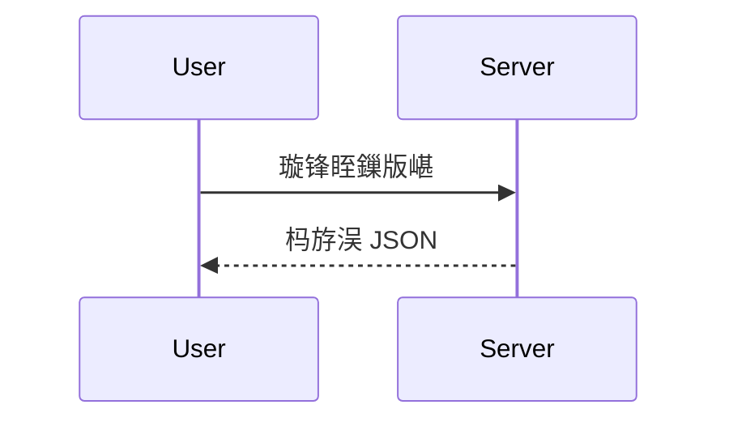
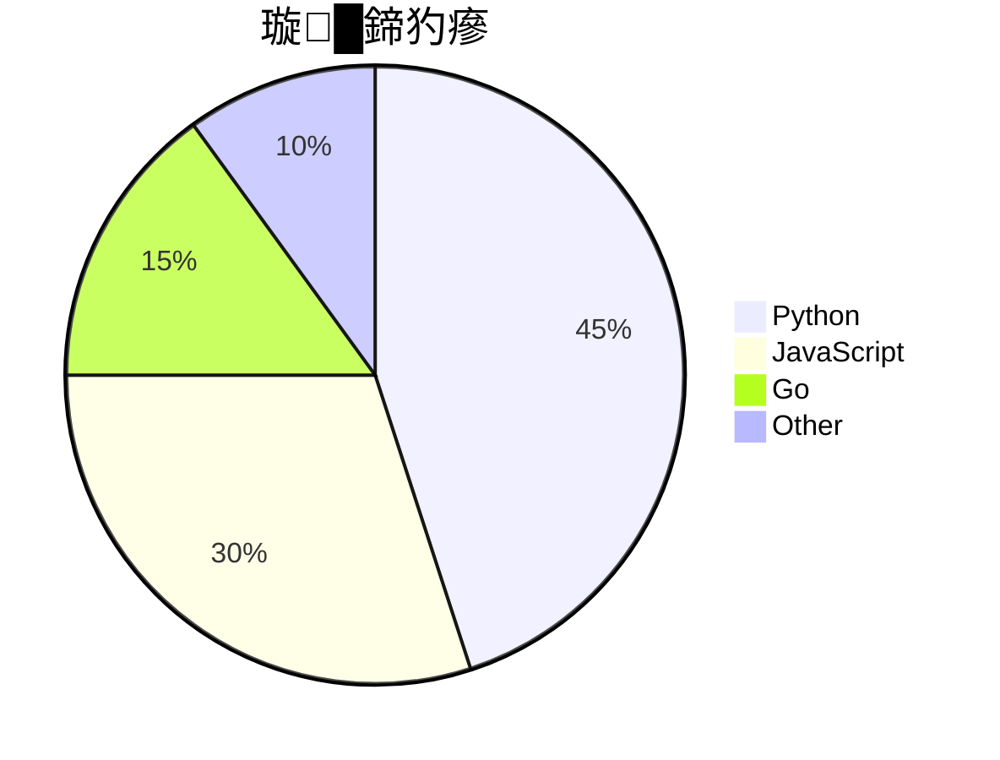
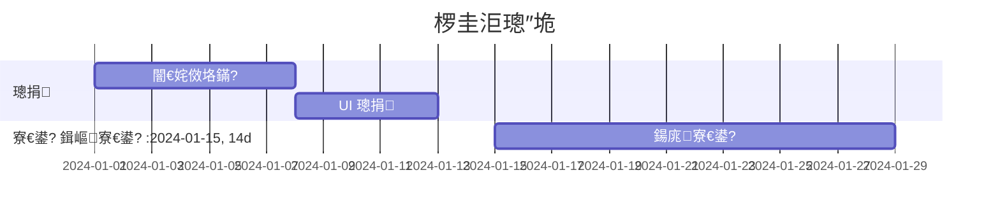

# Markdown 璇硶閫熸煡 + 灏忕粏鑺?
鏀堕泦 GitHub 涓婂ソ鐢ㄤ絾瀹规槗琚拷鐣ョ殑 Markdown / HTML 灏忕粏鑺傘€?
---

## 1. 鏂囨湰鏍峰紡

```markdown
**鍔犵矖**
*鏂滀綋*
***鍔犵矖鏂滀綋***
~~鍒犻櫎绾縹~
`琛屽唴浠ｇ爜`
<u>涓嬪垝绾匡紙闇€ HTML锛?/u>
H~2~O 涓嬫爣锛堥渶 HTML 鎴栭儴鍒嗘墿灞曪級
X^2^ 涓婃爣锛堥儴鍒嗘墿灞曪級
```

鏁堟灉锛?
**鍔犵矖** 路 *鏂滀綋* 路 ***鍔犵矖鏂滀綋*** 路 ~~鍒犻櫎绾縹~ 路 `琛屽唴浠ｇ爜` 路 <u>涓嬪垝绾?/u> 路 H<sub>2</sub>O 路 X<sup>2</sup>

---

## 2. 閿洏鎸夐敭鏍峰紡

```markdown
鎸?<kbd>Ctrl</kbd> + <kbd>C</kbd> 澶嶅埗
```

鎸?<kbd>Ctrl</kbd> + <kbd>C</kbd> 澶嶅埗

---

## 3. 浠诲姟鍒楄〃 / 澶嶉€夋

```markdown
- [x] 宸插畬鎴愪换鍔?- [ ] 鏈畬鎴愪换鍔?- [ ] 绗笁椤?```

- [x] 宸插畬鎴愪换鍔?- [ ] 鏈畬鎴愪换鍔?- [ ] 绗笁椤?
鍦?Issue / PR 閲屽彲浠ョ洿鎺ョ偣鍑诲嬀閫夈€?
---

## 4. 鑴氭敞锛圙itHub 鏀寔锛?
```markdown
杩欓噷鏈変竴涓剼娉╗^1]銆?
[^1]: 杩欐槸鑴氭敞鐨勫唴瀹广€?```

杩欓噷鏈変竴涓剼娉╗^1]銆?
[^1]: 杩欐槸鑴氭敞鐨勫唴瀹广€?
---

## 5. 鑷姩閾炬帴

```markdown
https://github.com
<https://github.com>
user@example.com
<user@example.com>
```

浼氳嚜鍔ㄥ彉鎴愬彲鐐瑰嚮閾炬帴銆?
---

## 6. 鎻愬強涓庡紩鐢?
```markdown
@鐢ㄦ埛鍚?         鈫?鎻愬強鐢ㄦ埛
#123             鈫?寮曠敤 Issue
GH-123           鈫?寮曠敤 Issue
22ABLE22/awesome-markdown-tips#123   鈫?璺ㄤ粨搴?Issue
```

---

## 7. Emoji

```markdown
:rocket: :star: :heart: :warning: :bulb: :100: :tada:
:sparkles: :fire: :bug: :books: :wrench: :package:
```

鏁堟灉锛氿煔€ 猸?鉂わ笍 鈿狅笍 馃挕 馃挴 馃帀 鉁?馃悶 馃悰 馃摎 馃敡 馃摝

瀹屾暣鍒楄〃锛歨ttps://github.com/ikatyang/emoji-cheat-sheet

---

## 8. 楂樹寒鏍囪锛坄==鏂囨湰==` 閮ㄥ垎骞冲彴鏀寔锛?
GitHub 鍘熺敓 Markdown **涓嶆敮鎸?* `==楂樹寒==`锛屼絾閮ㄥ垎娓叉煋鍣ㄦ敮鎸併€侴itHub 涓婂彲鐢細

```html
<mark>楂樹寒鏂囨湰</mark>
```

鏁堟灉锛?mark>楂樹寒鏂囨湰</mark>

---

## 9. 鎶樺彔鍐呭

```markdown
<details>
  <summary>鐐瑰嚮灞曞紑</summary>

  鍐呭鍐欏湪杩欓噷锛堝墠鍚庣┖琛屽緢閲嶈锛?
</details>
```

娉ㄦ剰锛?1. `<summary>` 鍜屾鏂囦箣闂村繀椤绘湁绌鸿
2. `</details>` 鍓嶄篃瑕佹湁绌鸿
3. 鍚﹀垯鍐呭浼氫互绾枃鏈樉绀?
---

## 10. 鍥剧墖杩涢樁

### 10.1 鎸囧畾瀹介珮

```html


```

### 10.2 灞呬腑

```html
<div align="center">
  
</div>
```

### 10.3 鐩稿璺緞 + 閿氱偣閾炬帴鍥剧墖

```markdown
[](https://example.com)
```

### 10.4 鏆楄壊妯″紡閫傞厤锛堜粎閮ㄥ垎浠撳簱鏀寔锛?
```html
<picture>
  <source media="(prefers-color-scheme: dark)" srcset="./logo-dark.png">
  
</picture>
```

---

## 11. 琛ㄦ儏鍙嶅簲寰界珷锛圓ll Contributors锛?
```markdown
<!-- readme 妯℃澘涓?-->
<a href="https://github.com/22ABLE22/awesome-markdown-tips/graphs/contributors">
  
</a>
```

鐢?[allcontributors.org](https://allcontributors.org) 鏈哄櫒浜鸿嚜鍔ㄧ敓鎴愯础鐚€呭垪琛細

```markdown
@all-contributors please add @alice for code, doc
```

---

## 12. Mermaid 鍥捐〃

GitHub 鍘熺敓鏀寔 Mermaid锛?
````markdown
```mermaid
graph TD
    A[寮€濮媇 --> B{鏉′欢?}
    B -->|鏄瘄 C[鎵ц A]
    B -->|鍚 D[鎵ц B]
    C --> E[缁撴潫]
    D --> E
```
````

```mermaid
graph TD
    A[寮€濮媇 --> B{鏉′欢?}
    B -->|鏄瘄 C[鎵ц A]
    B -->|鍚 D[鎵ц B]
    C --> E[缁撴潫]
    D --> E
```

### 甯哥敤鍥捐〃绫诲瀷







鏇村绫诲瀷锛歚flowchart` `sequenceDiagram` `classDiagram` `stateDiagram` `erDiagram` `journey` `gantt` `pie` `mindmap` `timeline` `quadrantChart` `xychart-beta`

---

## 13. 鏁板鍏紡锛圠aTeX锛?
GitHub 鏀寔 `$...$` 涓?`$$...$$`锛?
```markdown
琛屽唴鍏紡锛?E = mc^2$

鍧楃骇鍏紡锛?
$$
\sum_{i=1}^{n} i = \frac{n(n+1)}{2}
$$
```

鏁堟灉锛?
琛屽唴鍏紡锛?E = mc^2$

鍧楃骇鍏紡锛?
$$
\sum_{i=1}^{n} i = \frac{n(n+1)}{2}
$$

---

## 14. 浠ｇ爜鍧楀彉浣?
| 璇█鏍囪瘑 | 鐢ㄩ€?|
|----------|------|
| `python` / `py` | Python |
| `javascript` / `js` | JS |
| `typescript` / `ts` | TS |
| `json` | JSON |
| `yaml` / `yml` | YAML |
| `bash` / `sh` / `console` | Shell |
| `diff` | Diff 瀵规瘮 |
| `sql` | SQL |
| `html` | HTML |
| `css` | CSS |
| `go` / `rust` / `java` / `c` / `cpp` | 鍚勮瑷€ |
| `mermaid` | 鍥捐〃 |
| `text` / 鐣欑┖ | 绾枃鏈?|

### diff 楂樹寒

````markdown
```diff
- 杩欒浼氳鍒犻櫎
+ 杩欒鏄柊澧?  杩欒涓嶅彉
```
````

---

## 15. 宓屽鍒楄〃涓庣缉杩?
```markdown
1. 涓€绾?   - 浜岀骇
     - 涓夌骇
       ```python
       # 浠ｇ爜鍧椾篃鏀寔宓屽锛堟敞鎰忕缉杩涳級
       print("hello")
       ```
2. 鍥炲埌涓€绾?```

缂╄繘鐢?**绌烘牸**锛? 鎴?4 涓級锛屼笉瑕佺敤 Tab銆?
---

## 16. 瀹氫箟鍒楄〃锛圙itHub 涓嶆敮鎸佸師鐢燂級

鍙敤 HTML 妯℃嫙锛?
```html
<dl>
  <dt>鏈 A</dt>
  <dd>瑙ｉ噴 A</dd>
  <dt>鏈 B</dt>
  <dd>瑙ｉ噴 B</dd>
</dl>
```

---

## 17. 棰滆壊鏂囧瓧 / 鑳屾櫙锛圚TML锛?
```html
<span style="color:#39C5BB">闈掕壊鏂囧瓧</span>
<span style="background:#1a1a2e;color:#fff;padding:2px 6px;border-radius:4px">娣辫壊鏍囩</span>
```

鏁堟灉锛堥儴鍒嗗钩鍙版覆鏌擄級锛?
<span style="color:#39C5BB">闈掕壊鏂囧瓧</span> 路 <span style="background:#1a1a2e;color:#fff;padding:2px 6px;border-radius:4px">娣辫壊鏍囩</span>

---

## 18. 鍝嶅簲寮忓搴﹀浘鐗囧鍣?
```html
<p align="center">
  
</p>
```

---

## 19. 鍒嗘爮甯冨眬锛圚TML table 妯℃嫙锛?
```html
<table>
  <tr>
    <td width="50%" valign="top">

### 宸︽爮鏍囬

鍐呭鍐欏湪杩欓噷锛屾敮鎸?Markdown锛堟敞鎰忓墠闈㈢┖琛岋級

    </td>
    <td width="50%" valign="top">

### 鍙虫爮鏍囬

鍐呭鍐欏湪杩欓噷

    </td>
  </tr>
</table>
```

---

## 20. 鍥炲埌椤堕儴

```markdown
<div align="right">

[](#)

</div>
```

---

## 21. 杞箟瀛楃

| 鎯虫樉绀?| 鍐欐硶 |
|--------|------|
| `*` | `\*` |
| `_` | `\_` |
| `#` | `\#` |
| `[]` | `\[\]` |
| `!` | `\!` |
| `` ` `` | `` \` `` |
| `\` | `\\` |

---

## 22. HTML 娉ㄩ噴 / 闅愯棌鍐呭

```markdown
<!-- 杩欐娉ㄩ噴涓嶄細鏄剧ず鍦ㄦ覆鏌撶粨鏋滀腑 -->

<!--
澶氳娉ㄩ噴
澶氳娉ㄩ噴
-->
```

---

## 23. Issue / PR 妯℃澘

鍦ㄤ粨搴撲腑鍒涘缓锛?
```
.github/
  ISSUE_TEMPLATE/
    bug_report.md
    feature_request.md
  PULL_REQUEST_TEMPLATE.md
```

`bug_report.md` 绀轰緥锛?
```markdown
---
name: Bug report
about: 鎶ュ憡涓€涓棶棰?title: "[Bug] "
labels: bug
assignees: ""
---

**鎻忚堪**
娓呮櫚绠€娲佸湴鎻忚堪闂銆?
**澶嶇幇姝ラ**
1. 鎵撳紑 '...'
2. 鐐瑰嚮 '....'
3. 鐪嬪埌閿欒

**鏈熸湜琛屼负**
浣犳湡鏈涘彂鐢熶粈涔堛€?
**鎴浘**
濡傛灉閫傜敤锛屾坊鍔犳埅鍥俱€?
**鐜**
 - OS: [e.g. Windows 11]
 - Browser: [e.g. Chrome 120]
 - Version: [e.g. 1.0.0]
```

---

## 24. GitHub Actions 鐘舵€佸窘绔?
```markdown

```

鎶?`.yml` 鏂囦欢鍚嶆崲鎴愪綘瀹為檯鐨?workflow 鏂囦欢銆?
---

## 25. 浠撳簱鎻忚堪閲岀殑 emoji / 璇濋

- 浠撳簱 **About** 鎻忚堪鏀寔 emoji
- Topics 鐢ㄥ皬鍐欍€佽繛瀛楃锛歚machine-learning` `python` `cli`
- 缃《浠撳簱锛圥rofile Pin锛夊彲绐佸嚭灞曠ず 6 涓?
---

## 灏忕粨锛氭渶鍊煎緱璁颁綇鐨?10 鏉?
1. **Shields.io** 涓€鏉?URL 灏辫兘鍑哄窘绔狅紝璁板緱 `style` 鍜?`logo` 鍙傛暟
2. **github-readme-stats** 涓変欢濂楋細stats / top-langs / streak
3. **star-history** 涓€琛屼唬鐮佺敾鍑?Star 鎶樼嚎鍥?4. **`<details>` 鎶樺彔** 鍓嶅悗蹇呴』绌鸿
5. **skillicons.dev** 涓€琛屾憜鍑烘暣鎺掓妧鏈浘鏍?6. **Typing SVG** 璁╂爣棰樺姩璧锋潵
7. **capsule-render** 鍋氬嚭濂界湅鐨勯〉鐪夐〉鑴氭尝娴?8. **contrib.rocks** 鑷姩澶村儚澧?9. **`> [!NOTE]`** 绛?GitHub 鍘熺敓鎻愮ず鍧?10. **琛ㄦ牸 + HTML** 缁勫悎鍙互鍋氬嚭浠绘剰甯冨眬

---

[猬嗭笍 鍥炲埌涓绘枃妗(./README.md)

