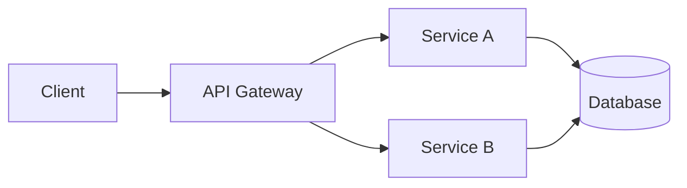

# 项目 README 骨架

一个功能完整的项目 README 结构，可按需删减章节。

---

## 完整骨架

```markdown
<div align="center">

# 🚀 Project Name

[](https://github.com/OWNER/REPO/releases/latest)
[](https://github.com/OWNER/REPO/blob/main/LICENSE)
[](https://github.com/OWNER/REPO/actions/workflows/ci.yml)
[](https://codecov.io/gh/OWNER/REPO)
[](https://github.com/OWNER/REPO/releases)
[](https://github.com/OWNER/REPO/stargazers)

**One sentence that says what this project does and why it matters.**

[English](./README.md) · [简体中文](./README.zh-CN.md) · [Docs](https://docs.example.com) · [Demo](https://demo.example.com)


</div>

---

## 📖 Table of Contents

- [About](#-about)
- [Features](#-features)
- [Installation](#-installation)
- [Quick Start](#-quick-start)
- [Configuration](#-configuration)
- [Usage](#-usage)
- [API Reference](#-api-reference)
- [Architecture](#-architecture)
- [Contributing](#-contributing)
- [Changelog](#-changelog)
- [License](#-license)
- [Acknowledgements](#-acknowledgements)

---

## 📖 About

一段项目背景介绍：解决什么问题、目标用户是谁、与同类项目的差异。

## ✨ Features

- ✅ Feature one
- ✅ Feature two
- ✅ Feature three

<details>
<summary>More features</summary>

- Extra feature A
- Extra feature B

</details>

## 📦 Installation

### npm

```bash
npm install package-name
```

### pip

```bash
pip install package-name
```

### Docker

```bash
docker pull owner/repo:latest
```

## 🚀 Quick Start

```bash
# 一行启动
npx package-name init
```

```python
from package import hello

hello("world")
```

## ⚙️ Configuration

| Variable | Type | Default | Description |
|----------|------|---------|-------------|
| `API_KEY` | string | `""` | 你的 API Key |
| `PORT` | number | `3000` | 服务端口 |
| `DEBUG` | bool | `false` | 是否开启调试 |

> [!TIP]
> 建议通过 `.env` 文件配置敏感信息，并加入 `.gitignore`。

## 📚 Usage

### Basic

```js
import { doSomething } from 'package-name';

await doSomething({ key: 'value' });
```

### Advanced

```js
const result = await doSomething({
  key: 'value',
  retries: 3,
  timeout: 5000,
});
```

## 🏗 Architecture



## 🤝 Contributing

1. Fork the repository
2. Create your feature branch (`git checkout -b feature/amazing`)
3. Commit your changes (`git commit -m 'Add amazing feature'`)
4. Push to the branch (`git push origin feature/amazing`)
5. Open a Pull Request

See [CONTRIBUTING.md](./CONTRIBUTING.md) for details.

## 📄 License

Distributed under the MIT License. See [LICENSE](./LICENSE) for more information.

## 🌟 Star History

[](https://star-history.com/#OWNER/REPO&Date)

## 🙏 Acknowledgements

- [Library A](https://github.com/a) — used for X
- [Library B](https://github.com/b) — used for Y

## 👥 Contributors

[](https://github.com/OWNER/REPO/graphs/contributors)

---

<div align="center">

Made with ❤️ by [Alice](https://github.com/alice)

</div>
```

---

## 章节取舍建议

| 项目类型 | 建议保留章节 |
|----------|-------------|
| 开源库 | About / Features / Install / Quick Start / Config / API / Contributing / License / Star History |
| CLI 工具 | About / Install / Usage / Commands / Config / Contributing |
| Web 应用 | About / Demo / Screenshots / Install / Deploy / Contributing |
| 学习笔记 | About / TOC / 正文 / References |
| 工具集 / 合集 | About / 分类列表 / 使用方法 / 贡献指南 |

---

## 常用徽章速查（项目用）

```markdown
<!-- 版本 -->


<!-- 质量 -->


<!-- 合规 -->


<!-- 活跃度 -->


<!-- 社交 -->


<!-- 平台 -->


```

---

## 多语言 README 命名约定

| 文件 | 语言 |
|------|------|
| `README.md` | English（默认） |
| `README.zh-CN.md` | 简体中文 |
| `README.zh-TW.md` | 繁体中文 |
| `README.ja.md` | 日本语 |
| `README.ko.md` | 한국어 |
| `README.es.md` | Español |

在文件顶部互链：

```markdown
English | [简体中文](./README.zh-CN.md)
```
