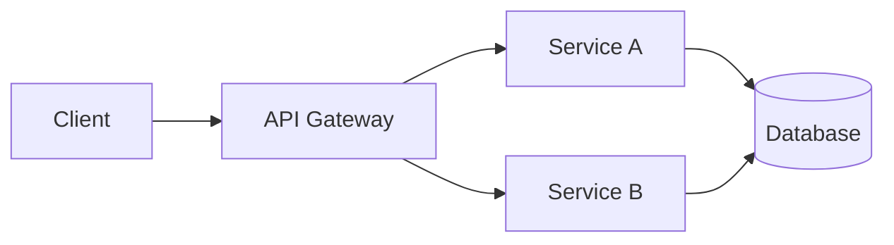

# 椤圭洰 README 楠ㄦ灦

涓€涓姛鑳藉畬鏁寸殑椤圭洰 README 缁撴瀯锛屽彲鎸夐渶鍒犲噺绔犺妭銆?
---

## 瀹屾暣楠ㄦ灦

```markdown
<div align="center">

# 馃殌 Project Name

[](https://github.com/22ABLE22/awesome-markdown-tips/releases/latest)
[](https://github.com/22ABLE22/awesome-markdown-tips/blob/main/LICENSE)
[](https://github.com/22ABLE22/awesome-markdown-tips/actions/workflows/ci.yml)
[](https://codecov.io/gh/22ABLE22/awesome-markdown-tips)
[](https://github.com/22ABLE22/awesome-markdown-tips/releases)
[](https://github.com/22ABLE22/awesome-markdown-tips/stargazers)

**One sentence that says what this project does and why it matters.**

[English](./README.md) 路 [绠€浣撲腑鏂嘳(./README.zh-CN.md) 路 [Docs](https://docs.example.com) 路 [Demo](https://demo.example.com)


</div>

---

## 馃摉 Table of Contents

- [About](#-about)
- [Features](#-features)
- [Installation](#-installation)
- [Quick Start](#-quick-start)
- [Configuration](#-configuration)
- [Usage](#-usage)
- [API Reference](#-api-reference)
- [Architecture](#-architecture)
- [Contributing](#-contributing)
- [Changelog](#-changelog)
- [License](#-license)
- [Acknowledgements](#-acknowledgements)

---

## 馃摉 About

涓€娈甸」鐩儗鏅粙缁嶏細瑙ｅ喅浠€涔堥棶棰樸€佺洰鏍囩敤鎴锋槸璋併€佷笌鍚岀被椤圭洰鐨勫樊寮傘€?
## 鉁?Features

- 鉁?Feature one
- 鉁?Feature two
- 鉁?Feature three

<details>
<summary>More features</summary>

- Extra feature A
- Extra feature B

</details>

## 馃摝 Installation

### npm

```bash
npm install package-name
```

### pip

```bash
pip install package-name
```

### Docker

```bash
docker pull 22ABLE22/awesome-markdown-tips:latest
```

## 馃殌 Quick Start

```bash
# 涓€琛屽惎鍔?npx package-name init
```

```python
from package import hello

hello("world")
```

## 鈿欙笍 Configuration

| Variable | Type | Default | Description |
|----------|------|---------|-------------|
| `API_KEY` | string | `""` | 浣犵殑 API Key |
| `PORT` | number | `3000` | 鏈嶅姟绔彛 |
| `DEBUG` | bool | `false` | 鏄惁寮€鍚皟璇?|

> [!TIP]
> 寤鸿閫氳繃 `.env` 鏂囦欢閰嶇疆鏁忔劅淇℃伅锛屽苟鍔犲叆 `.gitignore`銆?
## 馃摎 Usage

### Basic

```js
import { doSomething } from 'package-name';

await doSomething({ key: 'value' });
```

### Advanced

```js
const result = await doSomething({
  key: 'value',
  retries: 3,
  timeout: 5000,
});
```

## 馃彈 Architecture



## 馃 Contributing

1. Fork the repository
2. Create your feature branch (`git checkout -b feature/amazing`)
3. Commit your changes (`git commit -m 'Add amazing feature'`)
4. Push to the branch (`git push origin feature/amazing`)
5. Open a Pull Request

See [CONTRIBUTING.md](./CONTRIBUTING.md) for details.

## 馃搫 License

Distributed under the MIT License. See [LICENSE](./LICENSE) for more information.

## 馃専 Star History

[](https://star-history.com/#22ABLE22/awesome-markdown-tips&Date)

## 馃檹 Acknowledgements

- [Library A](https://github.com/a) 鈥?used for X
- [Library B](https://github.com/b) 鈥?used for Y

## 馃懃 Contributors

[](https://github.com/22ABLE22/awesome-markdown-tips/graphs/contributors)

---

<div align="center">

Made with 鉂わ笍 by [Alice](https://github.com/alice)

</div>
```

---

## 绔犺妭鍙栬垗寤鸿

| 椤圭洰绫诲瀷 | 寤鸿淇濈暀绔犺妭 |
|----------|-------------|
| 寮€婧愬簱 | About / Features / Install / Quick Start / Config / API / Contributing / License / Star History |
| CLI 宸ュ叿 | About / Install / Usage / Commands / Config / Contributing |
| Web 搴旂敤 | About / Demo / Screenshots / Install / Deploy / Contributing |
| 瀛︿範绗旇 | About / TOC / 姝ｆ枃 / References |
| 宸ュ叿闆?鍚堥泦 | About / 鍒嗙被鍒楄〃 / 浣跨敤鏂规硶 / 璐＄尞鎸囧崡 |

---

## 甯哥敤寰界珷閫熸煡锛堥」鐩敤锛?
```markdown
<!-- 鐗堟湰 -->


<!-- 璐ㄩ噺 -->


<!-- 鍚堣 -->


<!-- 娲昏穬搴?-->


<!-- 绀句氦 -->


<!-- 骞冲彴 -->


```

---

## 澶氳瑷€ README 鍛藉悕绾﹀畾

| 鏂囦欢 | 璇█ |
|------|------|
| `README.md` | English锛堥粯璁わ級 |
| `README.zh-CN.md` | 绠€浣撲腑鏂?|
| `README.zh-TW.md` | 绻佷綋涓枃 |
| `README.ja.md` | 鏃ユ湰璇?|
| `README.ko.md` | 頃滉淡鞏?|
| `README.es.md` | Espa帽ol |

鍦ㄦ枃浠堕《閮ㄤ簰閾撅細

```markdown
English | [绠€浣撲腑鏂嘳(./README.zh-CN.md)
```

