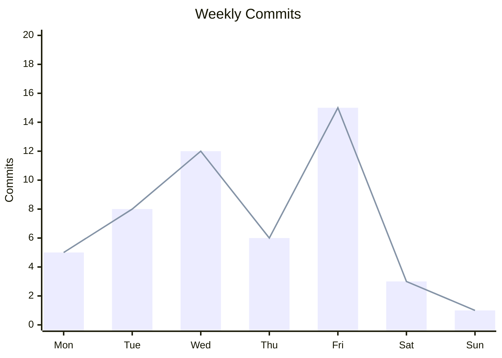
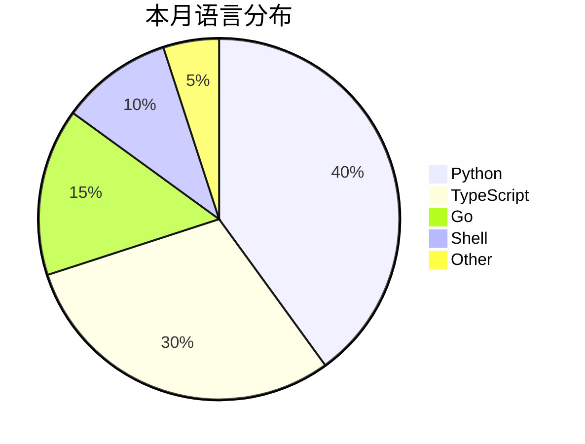

# 小部件与统计图集合 · Widgets

收集可直接嵌入 README 的动态小部件：折线图、统计卡、活动图、奖杯、访客等。

把 `YOUR_USERNAME`、`OWNER`、`REPO` 换成你的即可。

> [!IMPORTANT]
> 统计卡片请使用 **[GitHub Stats Extended](https://github.com/stats-organization/github-stats-extended)**。
> 域名：`https://github-stats-extended.vercel.app`
> 旧版 `github-readme-stats.vercel.app` 已停止维护，公共实例不可用；参数高度兼容，只需换域名。

---

## 1. GitHub Stats 主卡片

```markdown
[](https://github.com/stats-organization/github-stats-extended)
```

常用参数组合：

```text
# 极简无边框
?username=X&show_icons=true&theme=github_dark&hide_border=true

# 紧凑 + 隐藏标题
?username=X&show_icons=true&layout=compact&hide_title=true&hide_border=true

# 自定义配色
?username=X&show_icons=true&bg_color=0D1117&title_color=39C5BB&icon_color=39C5BB&text_color=C9D1D9&border_color=30363D

# 统计私有仓库（需在环境变量配置 PAT）
?username=X&show_icons=true&count_private=true&include_all_commits=true

# 深浅色自动切换（推荐）
<picture>
  <source srcset="https://github-stats-extended.vercel.app/api?username=X&theme=dark_github" media="(prefers-color-scheme: dark)" />
  
</picture>
```

在线可视化配置：[Card Wizard](https://github-stats-extended.vercel.app/frontend)

---

## 1.5 仓库 / Gist 置顶卡片

突破 GitHub 原生 6 个 Pin 限制：

```markdown
<!-- 仓库卡片 -->
[](https://github.com/YOUR_USERNAME/YOUR_REPO)

<!-- Gist 卡片 -->
[](https://gist.github.com/YOUR_GIST_ID)
```

---

## 2. Top Languages 语言占比

```markdown

```

参数：

| 参数 | 说明 |
|------|------|
| `layout=card` / `compact` | 卡片 / 紧凑 |
| `langs_count=8` | 显示语言数 |
| `hide=html,css,scss` | 隐藏语言 |
| `exclude_repo=repo1,repo2` | 排除仓库 |
| `size_weight=0.5` | 按代码体积加权 |
| `count_weight=0.5` | 按提交次数加权 |

---

## 3. Streak Stats 连续提交天数

```markdown
[](https://git.io/streak-stats)
```

参数：

| 参数 | 说明 |
|------|------|
| `user` | 用户名 |
| `theme` | 主题 |
| `hide_border=true` | 隐藏边框 |
| `date_format=YYYY-MM-DD` | 日期格式 |
| `locale=zh-cn` | 中文 |
| `mode=weekly` | 周模式 |
| `background=0D1117` | 背景色 |
| `border=30363D` | 边框色 |
| `stroke=39C5BB` | 强调色 |
| `ring=39C5BB` | 圆环色 |
| `fire=ff6b6b` | 火焰色 |
| `currStreakNum=ffffff` | 当前连续数字色 |

中文示例：

```markdown
[](https://git.io/streak-stats)
```

---

## 4. Activity Graph 活跃贡献图

```markdown
[](https://github.com/ashutosh00710/github-readme-activity-graph)
```

自定义颜色：

```text
?username=X
&bg_color=0D1117
&color=39C5BB
&line=39C5BB
&point=ffffff
&area=true
&area_color=39C5BB
&hide_border=true
&radius=16
&height=300
```

---

## 5. Star History 折线图

### 单仓库

```markdown
[](https://star-history.com/#OWNER/REPO&Date)
```

### 多仓库对比

```markdown
[](https://star-history.com/#facebook/react&vuejs/core&sveltejs/svelte&Date)
```

### 自己的仓库

把 `OWNER/REPO` 换成你的用户名和仓库名，即可在 README 中展示 star 增长曲线。

---

## 6. Profile Trophy 奖杯墙

```markdown
[](https://github.com/ryo-ma/github-profile-trophy)
```

主题：`flat` `onedark` `gruvbox` `dracula` `monokai` `chalk` `nord` `alduin` `darkhub` `juicyfresh` `buddhism` `oldie` `radical` `tokyonight` 等。

参数：

| 参数 | 说明 |
|------|------|
| `column=6` | 一行几个 |
| `row=2` | 几行 |
| `no-frame=true` | 无边框 |
| `no-bg=true` | 透明背景 |
| `margin-w` / `margin-h` | 边距 |
| `title=commits,stars,followers` | 只显示部分 |

---

## 7. Profile Summary Cards

```markdown
<!-- 仓库语言分布 -->
[](https://github.com/VN7N24FZKQ/github-profile-summary-cards)

<!-- 产品统计 -->
[](https://github.com/VN7N24FZKQ/github-profile-summary-cards)

<!-- 详细统计 -->
[](https://github.com/VN7N24FZKQ/github-profile-summary-cards)

<!-- 提交时间分布 -->
[](https://github.com/VN7N24FZKQ/github-profile-summary-cards)
```

---

## 8. RepoBeats 仓库活跃折线图

```markdown
[](https://repobeats.axiom.co)
```

会展示一段时间内 issue / PR / commit 活动的折线图。

---

## 9. 贡献者头像墙

```markdown
[](https://github.com/OWNER/REPO/graphs/contributors)
```

参数：

```
?max=21           # 最多显示
&anon=true        # 匿名贡献者
&columns=7        # 每行个数（部分版本支持）
```

---

## 10. 访客计数器

```markdown
<!-- komarev -->


<!-- hits.sh -->

```

komarev 参数：

| 参数 | 说明 |
|------|------|
| `color` | 颜色名或 hex |
| `style` | `flat` / `plastic` |
| `label` | 自定义文字 |
| `base` | 起始计数 |

---

## 11. Typing SVG 打字机

```markdown
<p align="center">
  
</p>
```

参数速查：

| 参数 | 默认 | 说明 |
|------|------|------|
| `font` | `monospace` | 字体名 |
| `weight` | `400` | 字重 |
| `size` | `28` | 字号 |
| `duration` | `5000` | 每行耗时 ms |
| `pause` | `0` | 停顿 ms |
| `color` | `36BCF7` | 颜色 |
| `center` | `false` | 水平居中 |
| `vCenter` | `false` | 垂直居中 |
| `multiline` | `false` | 多行 |
| `repeat` | `true` | 循环 |
| `width` / `height` | `435` / `50` | 画布 |
| `lines` | — | 用 `;` 分隔 |
| `start` | `true` | 立即开始 |
| `separator` | `;` | 行分隔符 |

常用字体：

```
Fira Code · JetBrains Mono · Roboto Mono · Source Code Pro
Ubuntu Mono · Space Mono · IBM Plex Mono · Inconsolata
Pacifico · Caveat · Montserrat · Poppins · Raleway
```

---

## 12. Capsule Render 页眉页脚

```markdown
<!-- 页眉 -->
<p align="center">
  
</p>

<!-- 页脚 -->
<p align="center">
  
</p>
```

常用参数：

| 参数 | 说明 |
|------|------|
| `type` | `wave` `waving` `rounded` `slice` `rect` `soft` `stripe` `venom` `transparent` `auto` `cylinder` `egg` `shark` `amoled` |
| `color` | `0:颜色1,100:颜色2` 渐变 |
| `height` | 高度 |
| `section` | `header` / `footer` |
| `text` | 文字（URL 编码） |
| `fontSize` / `fontColor` | 文字样式 |
| `desc` / `descSize` / `descAlignY` | 副标题 |
| `animation` | `fadeIn` `scaleIn` `blink` `wave` `appear` |
| `reverse` | `true` 反转 |
| `reversal` | `true` 文字反转 |
| `rotate` | 旋转文字 |
| `textBg` | 文字背景 true/false |
| `gradient` | 关闭渐变 true/false |

配色示例：

```
?color=0:20232a,100:61dafb          # React 蓝
?color=0:0f2027,100:2c5364          # 深青
?color=0:8e2de2,100:4a00e0          # 紫
?color=0:ee0979,100:ff6a00          # 粉橙
?color=0:43cea2,100:185a9d          # 青蓝
```

---

## 13. WakaTime 编程时长

前提：注册 [WakaTime](https://wakatime.com)，安装插件，绑定 GitHub。

```markdown
[](https://wakatime.com/@YOUR_USERNAME)
```

---

## 14. 个人成就徽章（用静态徽章模拟）

```markdown


```

---

## 15. 技能图标条（skillicons）

```markdown
<!-- 分两行，每行 5-8 个 -->


```

---

## 16. 动态语言 / 统计组合布局示例

```html
<div align="center">
  
  
</div>

<br/>

<div align="center">
  
</div>

<br/>

<div align="center">
  <a href="https://github.com/OWNER/REPO">
    
  </a>
</div>
```

---

## 17. Mermaid 自定义统计图

如果你有本地统计数据（比如每周 commit），可以手写 Mermaid：

````markdown

````


````markdown

````


---

## 18. 组件来源一览

> [!WARNING]
> 统计卡片请使用 **GitHub Stats Extended**（`github-stats-extended.vercel.app`）。
> 旧的 `github-readme-stats.vercel.app` 已停止维护，公共实例不可用。

| 组件 | 服务域名 | 开源仓库 |
|------|----------|----------|
| GitHub Stats / Top Langs / WakaTime / Pin / Gist | github-stats-extended.vercel.app | [stats-organization/github-stats-extended](https://github.com/stats-organization/github-stats-extended) |
| github-readme-stats（旧，已停维护） | github-readme-stats.vercel.app | [anuraghazra/github-readme-stats](https://github.com/anuraghazra/github-readme-stats) |
| Streak | streak-stats.demolab.com | [DenverCoder1/github-readme-streak-stats](https://github.com/DenverCoder1/github-readme-streak-stats) |
| Activity Graph | vercel.app | [Ashutosh00710/github-readme-activity-graph](https://github.com/Ashutosh00710/github-readme-activity-graph) |
| Typing SVG | demolab.com | [DenverCoder1/readme-typing-svg](https://github.com/DenverCoder1/readme-typing-svg) |
| Capsule Render | vercel.app | [kyechan99/capsule-render](https://github.com/kyechan99/capsule-render) |
| Trophy | vercel.app | [ryo-ma/github-profile-trophy](https://github.com/ryo-ma/github-profile-trophy) |
| Profile Summary | vercel.app | [VN7N24FZKQ/github-profile-summary-cards](https://github.com/VN7N24FZKQ/github-profile-summary-cards) |
| Star History | api.star-history.com | [star-history/star-history](https://github.com/star-history/star-history) |
| Contributors | contrib.rocks | [contrib.rocks](https://contrib.rocks) |
| Skill Icons | skillicons.dev | [tandpfun/skillicons](https://github.com/tandpfun/skillicons) |
| Visitor | komarev.com | [antonkomarev/github-profile-views-counter](https://github.com/antonkomarev/github-profile-views-counter) |
| RepoBeats | repobeats.axiom.co | — |

---

## 19. 公共 API 限流与自建

- 大部分服务免费但有缓存（5–30 分钟）
- 高频访问可能触发 429，稍等即可
- 需要统计私有仓库或更稳定时，可自建 **GitHub Stats Extended** 实例（Vercel 部署）
- 可视化配置：https://github-stats-extended.vercel.app/frontend

自建步骤简述：

1. Fork [stats-organization/github-stats-extended](https://github.com/stats-organization/github-stats-extended)
2. 部署到 Vercel
3. 在 Vercel 环境变量中添加 GitHub Token（权限按文档勾选 `repo` / `read:user` 等）
4. 把图片 URL 中的 `github-stats-extended.vercel.app` 换成你的部署域名

从旧版迁移：

```diff
- https://github-readme-stats.vercel.app/api?username=octocat&theme=radical
+ https://github-stats-extended.vercel.app/api?username=octocat&theme=radical
```

---

[⬆️ 回到主文档](./README.md)
