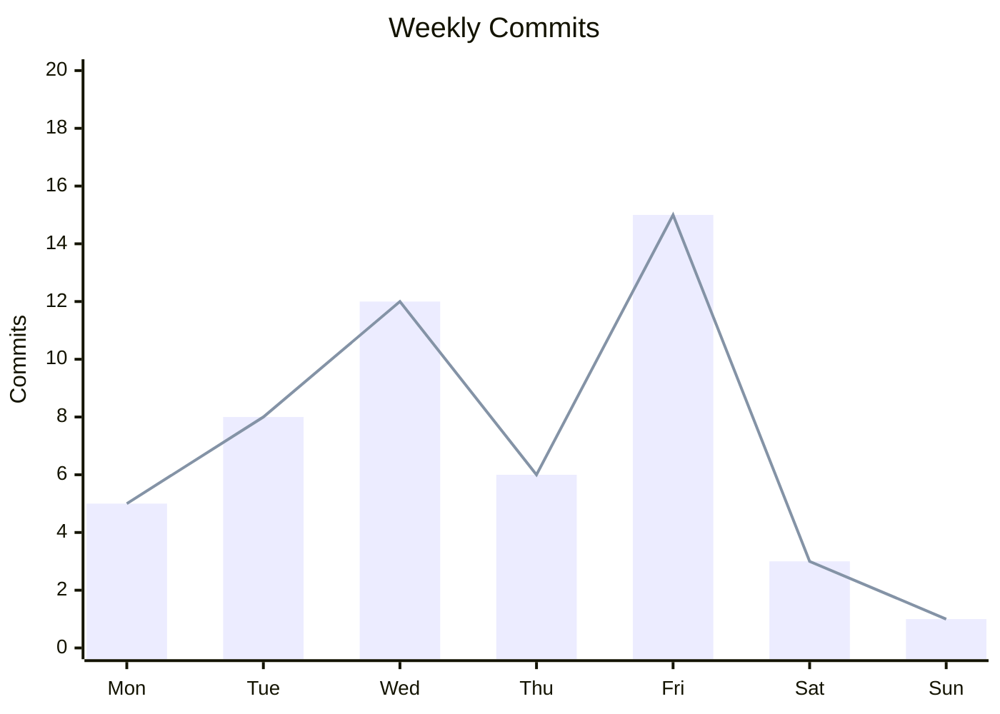
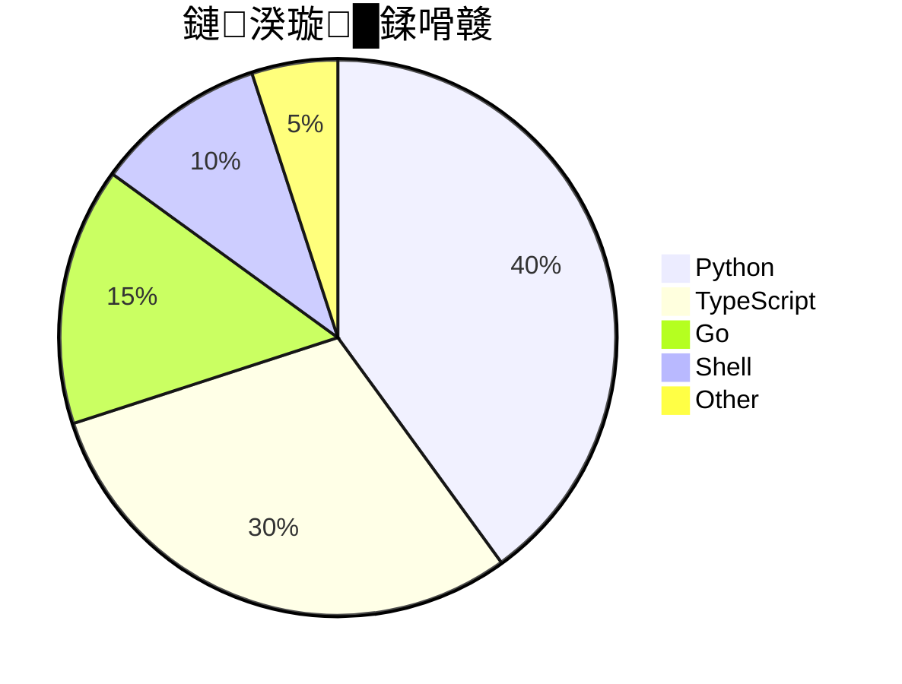

# 灏忛儴浠朵笌缁熻鍥鹃泦鍚?
鏀堕泦鍙洿鎺ュ祵鍏?README 鐨勫姩鎬佸皬閮ㄤ欢锛岄噸鐐规槸鎶樼嚎鍥俱€佺粺璁″崱銆佹椿鍔ㄥ浘銆佸鏉€佽瀹㈢瓑銆?
鎶?`22ABLE22`銆乣OWNER`銆乣REPO` 鎹㈡垚浣犵殑鍗冲彲銆?
---

## 1. GitHub Stats 涓诲崱鐗?
```markdown

```

甯哥敤鍙傛暟缁勫悎锛?
```text
# 鏋佺畝鏃犺竟妗??username=X&show_icons=true&theme=github_dark&hide_border=true

# 绱у噾 + 闅愯棌鏍囬
?username=X&show_icons=true&layout=compact&hide_title=true&hide_border=true

# 鑷畾涔夐厤鑹??username=X&show_icons=true&bg_color=0D1117&title_color=39C5BB&icon_color=39C5BB&text_color=C9D1D9&border_color=30363D

# 缁熻绉佹湁浠撳簱锛堥渶鍦ㄧ幆澧冨彉閲忛厤缃?PAT锛??username=X&show_icons=true&count_private=true&include_all_commits=true
```

---

## 2. Top Languages 璇█鍗犳瘮

```markdown

```

鍙傛暟锛?
| 鍙傛暟 | 璇存槑 |
|------|------|
| `layout=card` / `compact` | 鍗＄墖 / 绱у噾 |
| `langs_count=8` | 鏄剧ず璇█鏁?|
| `hide=html,css,scss` | 闅愯棌璇█ |
| `exclude_repo=repo1,repo2` | 鎺掗櫎浠撳簱 |
| `size_weight=0.5` | 鎸変唬鐮佷綋绉姞鏉?|
| `count_weight=0.5` | 鎸夋彁浜ゆ鏁板姞鏉?|

---

## 3. Streak Stats 杩炵画鎻愪氦澶╂暟

```markdown
[](https://git.io/streak-stats)
```

鍙傛暟锛?
| 鍙傛暟 | 璇存槑 |
|------|------|
| `user` | 鐢ㄦ埛鍚?|
| `theme` | 涓婚 |
| `hide_border=true` | 闅愯棌杈规 |
| `date_format=YYYY-MM-DD` | 鏃ユ湡鏍煎紡 |
| `locale=zh-cn` | 涓枃 |
| `mode=weekly` | 鍛ㄦā寮?|
| `background=0D1117` | 鑳屾櫙鑹?|
| `border=30363D` | 杈规鑹?|
| `stroke=39C5BB` | 寮鸿皟鑹?|
| `ring=39C5BB` | 鍦嗙幆鑹?|
| `fire=ff6b6b` | 鐏劙鑹?|
| `currStreakNum=ffffff` | 褰撳墠杩炵画鏁板瓧鑹?|

涓枃绀轰緥锛?
```markdown
[
```

---

## 4. Activity Graph 娲昏穬璐＄尞鍥?
```markdown
[](https://github.com/ashutosh00710/github-readme-activity-graph)
```

鑷畾涔夐鑹诧細

```text
?username=X
&bg_color=0D1117
&color=39C5BB
&line=39C5BB
&point=ffffff
&area=true
&area_color=39C5BB
&hide_border=true
&radius=16
&height=300
```

---

## 5. Star History 鎶樼嚎鍥?
### 鍗曚粨搴?
```markdown
[](https://star-history.com/#22ABLE22/awesome-markdown-tips&Date)
```

### 澶氫粨搴撳姣?
```markdown
[](https://star-history.com/#facebook/react&vuejs/core&sveltejs/svelte&Date)
```

### 鑷繁鐨勪粨搴?
鎶?`22ABLE22/awesome-markdown-tips` 鎹㈡垚浣犵殑鐢ㄦ埛鍚嶅拰浠撳簱鍚嶅嵆鍙湪 README 涓睍绀鸿嚜宸辩殑 star 澧為暱鏇茬嚎銆?
---

## 6. Profile Trophy 濂栨澂澧?
```markdown
[](https://github.com/ryo-ma/github-profile-trophy)
```

涓婚锛歚flat` `onedark` `gruvbox` `dracula` `monokai` `chalk` `nord` `alduin` `darkhub` `juicyfresh` `buddhism` `oldie` `onedark` `radical` `onedark` `gruvbox` `tokyonight` 绛夈€?
鍙傛暟锛?
| 鍙傛暟 | 璇存槑 |
|------|------|
| `column=6` | 涓€琛屽嚑涓?|
| `row=2` | 鍑犺 |
| `no-frame=true` | 鏃犺竟妗?|
| `no-bg=true` | 閫忔槑鑳屾櫙 |
| `margin-w` / `margin-h` | 杈硅窛 |
| `title=commits,stars,followers` | 鍙樉绀洪儴鍒?|

---

## 7. Profile Summary Cards

```markdown
<!-- 浠撳簱璇█鍒嗗竷 -->
[](https://github.com/VN7N24FZKQ/github-profile-summary-cards)

<!-- 浜у搧缁熻 -->
[](https://github.com/VN7N24FZKQ/github-profile-summary-cards)

<!-- 璇︾粏缁熻 -->
[](https://github.com/VN7N24FZKQ/github-profile-summary-cards)

<!-- 鎻愪氦鏃堕棿鍒嗗竷 -->
[](https://github.com/VN7N24FZKQ/github-profile-summary-cards)
```

---

## 8. RepoBeats 浠撳簱娲昏穬鎶樼嚎鍥?
```markdown
[](https://repobeats.axiom.co)
```

浼氬睍绀轰竴娈垫椂闂村唴 issue / PR / commit 娲诲姩鐨勬姌绾垮浘銆?
---

## 9. 璐＄尞鑰呭ご鍍忓

```markdown
[](https://github.com/22ABLE22/awesome-markdown-tips/graphs/contributors)
```

鍙傛暟锛?
```
?max=21           # 鏈€澶氭樉绀?&anon=true        # 鍖垮悕璐＄尞鑰?&columns=7        # 姣忚涓暟锛堥儴鍒嗙増鏈敮鎸侊級
```

---

## 10. 璁垮璁℃暟鍣?
```markdown
<!-- komarev -->


<!-- hits.sh -->

```

komarev 鍙傛暟锛?
| 鍙傛暟 | 璇存槑 |
|------|------|
| `color` | 棰滆壊鍚嶆垨 hex |
| `style` | `flat` / `plastic` |
| `label` | 鑷畾涔夋枃瀛?|
| `base` | 璧峰璁℃暟 |

---

## 11. Typing SVG 鎵撳瓧鏈?
```markdown
<p align="center">
  
</p>
```

鍙傛暟閫熸煡锛?
| 鍙傛暟 | 榛樿 | 璇存槑 |
|------|------|------|
| `font` | `monospace` | 瀛椾綋鍚?|
| `weight` | `400` | 瀛楅噸 |
| `size` | `28` | 瀛楀彿 |
| `duration` | `5000` | 姣忚鑰楁椂 ms |
| `pause` | `0` | 鍋滈】 ms |
| `color` | `36BCF7` | 棰滆壊 |
| `center` | `false` | 姘村钩灞呬腑 |
| `vCenter` | `false` | 鍨傜洿灞呬腑 |
| `multiline` | `false` | 澶氳 |
| `repeat` | `true` | 寰幆 |
| `width` / `height` | `435`/`50` | 鐢诲竷 |
| `lines` | 鈥?| `;` 鍒嗛殧 |
| `start` | `true` | 绔嬪嵆寮€濮?|
| `separator` | `;` | 琛屽垎闅旂 |

甯哥敤瀛椾綋锛?
```
Fira Code 路 JetBrains Mono 路 Roboto Mono 路 Source Code Pro
Ubuntu Mono 路 Space Mono 路 IBM Plex Mono 路 Inconsolata
Pacifico 路 Caveat 路 Montserrat 路 Poppins 路 Raleway
```

---

## 12. Capsule Render 椤电湁椤佃剼

```markdown
<!-- 椤电湁 -->
<p align="center">
  
</p>

<!-- 椤佃剼 -->
<p align="center">
  
</p>
```

甯哥敤鍙傛暟锛?
| 鍙傛暟 | 璇存槑 |
|------|------|
| `type` | `wave` `waving` `rounded` `slice` `rect` `soft` `stripe` `venom` `transparent` `auto` `cylinder` `egg` `shark` `amoled` |
| `color` | `0:棰滆壊1,100:棰滆壊2` 娓愬彉 |
| `height` | 楂樺害 |
| `section` | `header` / `footer` / `footer/header` |
| `text` | 鏂囧瓧锛圲RL 缂栫爜锛?|
| `fontSize` / `fontColor` | 鏂囧瓧鏍峰紡 |
| `desc` / `descSize` / `descAlignY` | 鍓爣棰?|
| `animation` | `fadeIn` `scaleIn` `blink` `wave` `appear` |
| `reverse` | `true` 鍙嶈浆 |
| `reversal` | `true` 鏂囧瓧鍙嶈浆 |
| `rotate` | 鏃嬭浆鏂囧瓧 |
| `textBg` | 鏂囧瓧鑳屾櫙 true/false |
| `gradient` | 鍏抽棴娓愬彉 true/false |

閰嶈壊绀轰緥锛?
```
?color=0:20232a,100:61dafb          # React 钃??color=0:0f2027,100:2c5364          # 娣遍潚
?color=0:8e2de2,100:4a00e0          # 绱??color=0:ee0979,100:ff6a00          # 绮夋
?color=0:43cea2,100:185a9d          # 闈掕摑
```

---

## 13. WakaTime 缂栫▼鏃堕暱

鍓嶆彁锛氭敞鍐?[WakaTime](https://wakatime.com)锛屽畨瑁呮彃浠讹紝缁戝畾 GitHub銆?
```markdown
[](https://wakatime.com/@22ABLE22)
```

---

## 14. 涓汉鎴愬氨寰界珷锛堢敤 static badge 妯℃嫙锛?
```markdown


```

---

## 15. 鎶€鑳藉浘鏍囨潯锛坰killicons锛?
```markdown
<!-- 鍒嗕袱琛岋紝姣忚 5-8 涓?-->


```

---

## 16. 鍔ㄦ€佽瑷€/缁熻缁勫悎甯冨眬绀轰緥

```html
<div align="center">
  
  
</div>

<br/>

<div align="center">
  
</div>

<br/>

<div align="center">
  <a href="https://github.com/22ABLE22/awesome-markdown-tips">
    
  </a>
</div>
```

---

## 17. Markdown 閲屽祵鍏?Mermaid 缁熻鍥撅紙鑷畾涔夋暟鎹級

濡傛灉浣犳湁鏈湴缁熻鏁版嵁锛堟瘮濡傛瘡鍛?commit锛夛紝鍙互鎵嬪啓 Mermaid锛?
````markdown

````


````markdown

````


---

## 18. 缁勪欢鏉ユ簮涓€瑙?
| 缁勪欢 | 鏈嶅姟 | 寮€婧愪粨搴?|
|------|------|----------|
| GitHub Stats | vercel.app | [anuraghazra/github-readme-stats](https://github.com/anuraghazra/github-readme-stats) |
| Top Langs | 鍚屼笂 | 鍚屼笂 |
| WakaTime | 鍚屼笂 | 鍚屼笂 |
| Streak | streak-stats.demolab.com | [DenverCoder1/github-readme-streak-stats](https://github.com/DenverCoder1/github-readme-streak-stats) |
| Activity Graph | vercel.app | [Ashutosh00710/github-readme-activity-graph](https://github.com/Ashutosh00710/github-readme-activity-graph) |
| Typing SVG | demolab.com | [DenverCoder1/readme-typing-svg](https://github.com/DenverCoder1/readme-typing-svg) |
| Capsule Render | vercel.app | [kyechan99/capsule-render](https://github.com/kyechan99/capsule-render) |
| Trophy | vercel.app | [ryo-ma/github-profile-trophy](https://github.com/ryo-ma/github-profile-trophy) |
| Profile Summary | vercel.app | [VN7N24FZKQ/github-profile-summary-cards](https://github.com/VN7N24FZKQ/github-profile-summary-cards) |
| Star History | api.star-history.com | [star-history/star-history](https://github.com/star-history/star-history) |
| Contributors | contrib.rocks | [contrib.rocks](https://contrib.rocks) |
| Skill Icons | skillicons.dev | [tandpfun/skillicons](https://github.com/tandpfun/skillicons) |
| Visitor | komarev.com | [antonkomarev/github-profile-views-counter](https://github.com/antonkomarev/github-profile-views-counter) |
| RepoBeats | repobeats.axiom.co | 鈥?|

---

## 19. 鍏叡 API 闄愭祦娉ㄦ剰

- 澶ч儴鍒嗘湇鍔″厤璐逛絾鏈夌紦瀛橈紙5鈥?0 鍒嗛挓锛?- 楂橀璁块棶鍙兘瑙﹀彂 429锛岀◢绛夊嵆鍙?- 鎯崇ǔ瀹氬睍绀鸿嚜宸辩殑绉佹湁浠撳簱鏁版嵁锛屽彲鑷缓 `github-readme-stats` 瀹炰緥锛圴ercel 涓€閿儴缃诧級

鑷缓姝ラ绠€杩帮細

1. Fork [github-readme-stats](https://github.com/anuraghazra/github-readme-stats)
2. 閮ㄧ讲鍒?Vercel
3. 鍦?Vercel 鐜鍙橀噺涓坊鍔?`PAT_1`锛堜綘鐨?GitHub Token锛屾潈闄愬嬀閫?`repo` / `read:user`锛?4. 鎶婂浘鐗?URL 涓殑 `github-readme-stats.vercel.app` 鎹㈡垚浣犵殑閮ㄧ讲鍩熷悕

---

[猬嗭笍 鍥炲埌涓绘枃妗(./README.md)

